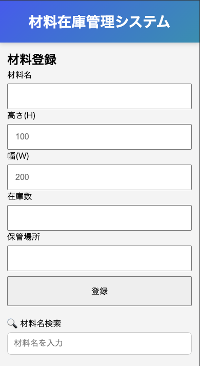
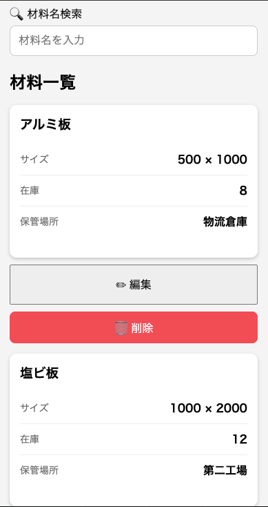

# 材料在庫管理システム

## 概要
材料の登録・検索・編集・削除・入出庫ができる在庫管理アプリです。

## 公開URL
https://material-stock-app.onrender.com/

## 使用技術

- HTML
- CSS
- JavaScript
- Node.js
- Express
- SQLite

## 主な機能

- 材料登録
- 材料編集
- 材料削除
- 入庫・出庫
- 材料名検索
- レスポンシブ対応

## 材料登録画面



## 材料一覧画面



## 起動方法

```bash
cd backend
npm install
npm run dev
```

## 今後の改善予定

- 現在は商品登録画面の入力フォームを編集機能でも共用しています。  
今後は一覧画面の各商品に「編集」ボタンを設置し、一覧画面上で直接編集できるUIへ改善予定です。
- バリデーションの強化
- 検索・並び替え機能の追加
- ページネーション
- 在庫数が少ない材料の色分け